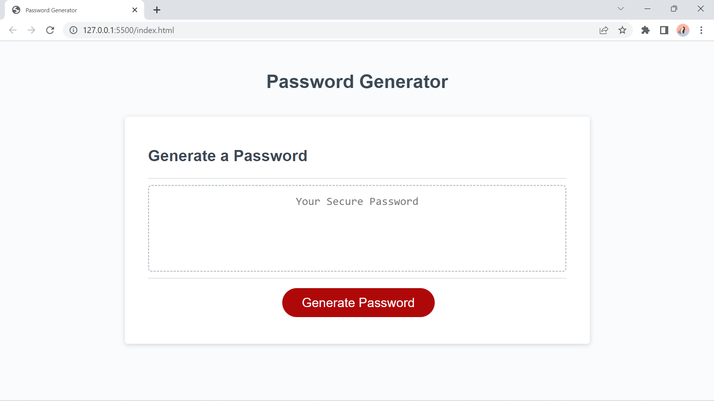
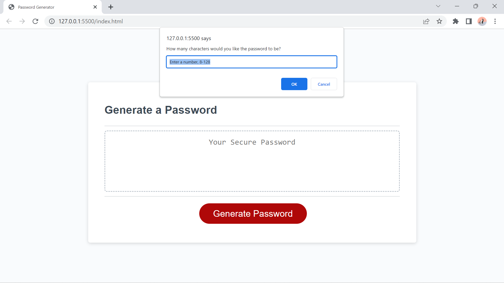
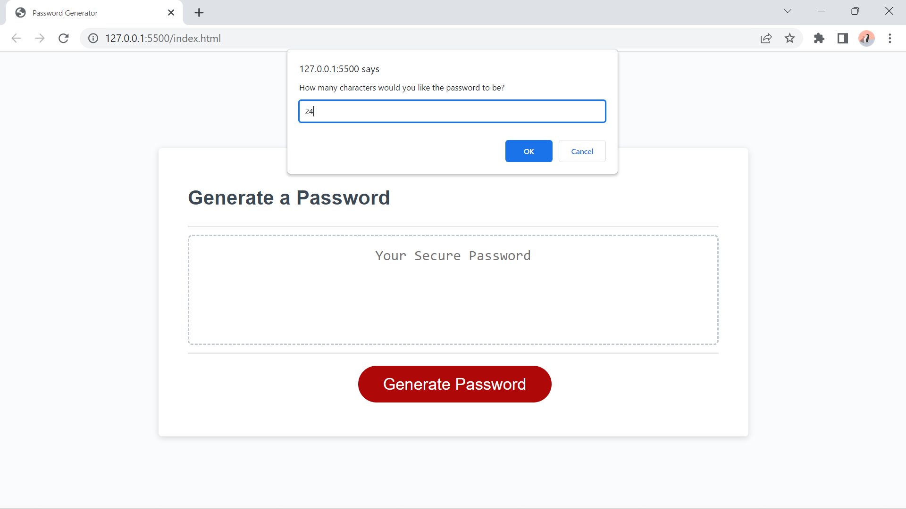
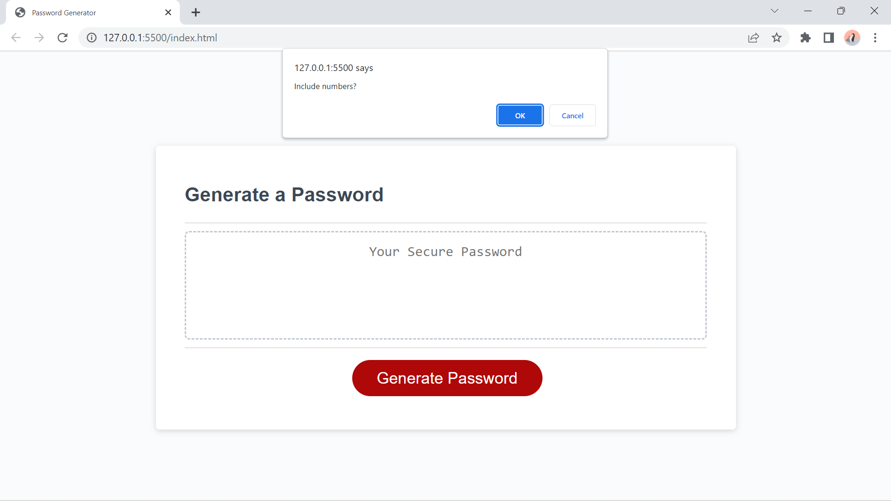
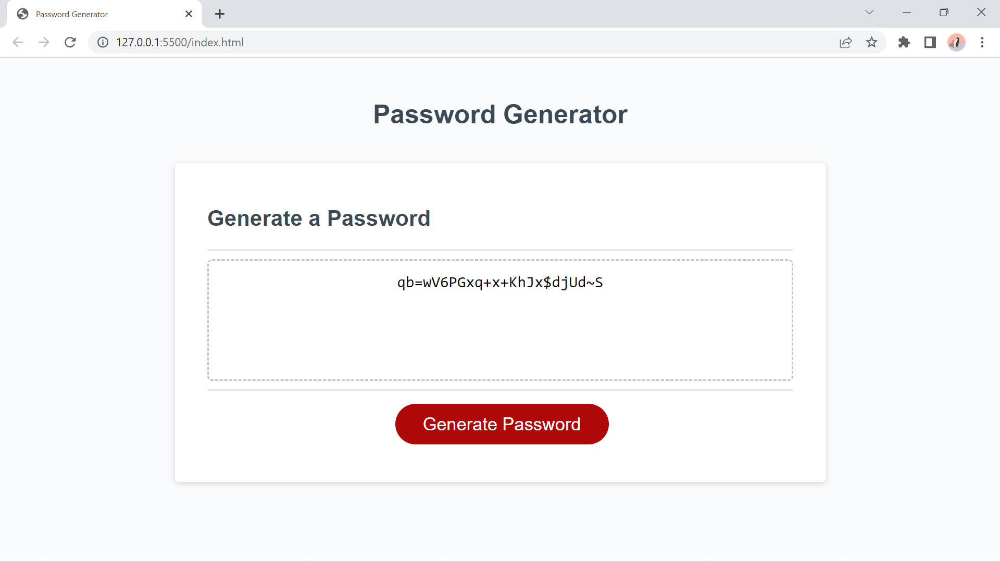

# youShallNotPassword

## Description
A simple webpage with a password generator.

## Motivation
To provide random, secure passwords for the protection of secure information.

## Installation
N/A

## Usage
Click the "Generate Password" button to begin a process of selecting password length and character set, and the resulting password will be returned in the text box to be copied.

## Screenshots
</img>
</img>
</img>
</img>
</img>
</img>
</img>
</img>

## Deployed URL
<a href=">